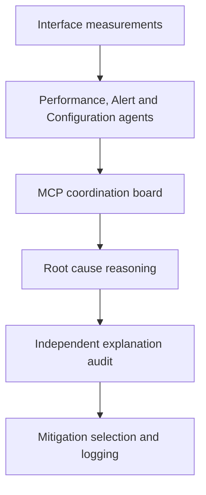

# Explainable Agentic Root Cause Analysis for Congestion Management in 5G Networks

**Detecting Service Deterioration and Autonomous Mitigation Decisions**

This research develops and evaluates a pipeline for identifying the network function responsible for congestion in a 5G core. It combines measured traffic, deterministic detection agents, evidence-supported root cause reasoning, an independent audit of the reasoning, and selection of a mitigation appropriate to the affected network plane.

The pipeline was evaluated across six controlled scenarios on a free5GC testbed. **Mitigation actions were selected and recorded; they were not executed on the running core.**

## Research aim

A congestion alert establishes that service is deteriorating, but similar symptoms can arise from different functions and require different responses. This project investigates whether a multi-agent pipeline can:

1. Identify congestion and attribute it to the responsible 5G network function.
2. Check an attributed cause against the recorded evidence.
3. Select an action appropriate to the affected control or user plane.

The dissertation addresses four research questions: the limits of detection and classification alone; the accuracy of network-function attribution; the explanation agent’s ability to detect divergence between a conclusion and its evidence; and the mitigation agent’s ability to select plane-appropriate actions.

## System architecture



- **Measurement:** Management functions observe the relevant interfaces and calculate utilisation against scenario-specific ceilings. Utilisation below 0.85 is *normal*; 0.85 to below 1.0 is *onset*; and 1.0 or above is *congestion*. A function that remains congested for 75 continuous seconds enters the *FAILING* state.
- **Detection:** Performance, Alert and Configuration agents analyse measurements and configuration without using a language model. They publish observations to the MCP coordination board.
- **Root cause reasoning:** The RCA agent examines those observations and retrieves supporting evidence from a knowledge base. It rederives the interface’s utilisation band rather than simply accepting a detection agent’s label.
- **Explanation audit:** A separate agent checks the committed conclusion against recorded evidence, applies deterministic verification rules and examines which evidence was necessary to the decision.
- **Mitigation selection:** A deterministic, model-predictive decision stage scores candidate actions over a short projected horizon. A language model can explain the selected action, but it does not choose it. The selection is logged and is **not applied to the network**.

The knowledge layer uses ChromaDB for retrieval, Neo4j for causal relationships and SQLite for structured baselines and rules.

## Testbed and scenarios

The evaluation used free5GC v3.4.1, simulated access-network components and controlled traffic generation. The original setup comprised three hosts on an isolated network—core, traffic generator and model server—running on a laptop with 32 GB of system memory and a GPU with 4 GB of VRAM.

| Scenario | Plane and condition | Responsible function |
| --- | --- | --- |
| N2 | Control-plane signalling congestion | AMF |
| N3 | User-plane traffic congestion | UPF |
| N4 | PFCP/session-management interface congestion | UPF |
| N6 | User-plane egress congestion | UPF |
| gNB downlink | Downlink forwarding-path congestion | gNB |
| End-to-end | Combined control-plane ramp, with N11 as the calibrated saturation point | SMF |

Each scenario was assessed against its own measurements and calibration. The testbed evaluated one injected scenario at a time.

## Results

The following results are from the **shared, settled evaluation window** reported in Chapter 5, Table 5.3 of the submitted dissertation. Detection and root cause attribution have different denominators: detection excludes cycles without a checkable calibrated ceiling; root cause attribution includes every confirmed congestion cycle.

| Scenario | Confirmed cycles | Correct detection | Correct root cause | Wrong root cause | No root cause returned |
| --- | ---: | ---: | ---: | ---: | ---: |
| N2 | 86 | 73/80 (91.3%) | 85/86 (98.8%) | 0 | 1 |
| N3 | 127 | 127/127 (100%) | 127/127 (100%) | 0 | 0 |
| N4 | 124 | 118/120 (98.3%) | 119/124 (96.0%) | 4 | 1 |
| N6 | 106 | 101/101 (100%) | 102/106 (96.2%) | 0 | 4 |
| gNB downlink | 148 | 142/148 (95.9%) | 123/148 (83.1%) | 0 | 25 |
| End-to-end | 74 | 74/74 (100%) | 74/74 (100%) | 0 | 0 |
| **Overall** | **665** | **635/650 (97.7%)** | **630/665 (94.7%)** | **4** | **31** |

Fifteen confirmed cycles were excluded from the detection denominator because their utilisation band could not be checked against a calibrated ceiling. N4 produced the four incorrect function attributions. The main attribution gap in the gNB downlink scenario was abstention: 25 cycles returned no root cause.

### Independent audit

The explanation-agent results in Chapter 5, Table 5.4 use a separate population of **1,707 explanation packets**:

| Measure | Result |
| --- | ---: |
| Investigation pass rate | 1,467/1,471 (99.73%) |
| Rule–model agreement on auditable packets | 1,599/1,606 (99.6%) |
| Rule–model agreement across all packets | 1,599/1,707 (93.7%) |
| Evidence-grounded rendered sentences | 12,174/12,458 (97.7%) |

The difference between the two agreement rates matters: **101 packets were audit-blind** because the observed interfaces lacked a calibrated rule verdict at commit time. They cannot be counted as verified agreement.

### Mitigation and runtime

The mitigation history recorded **618 selected actions** across its own capture windows, including **580 admission-control selections** and **33 traffic-shaping selections on N6**. These logs cover a different set of cycles from the 665 confirmed congestion cycles above and should not be treated as the same denominator.

Median pipeline latency was **25.1 seconds** on user-plane interfaces and **28.0 seconds** on control-plane interfaces. Median intervals between cycles were **66.3 seconds** and **67.6 seconds**, respectively. No action was applied to the running core, so these results do not establish service recovery after mitigation.

## Explore the implementation

Key entry points in the repository are:

| Path | Role |
| --- | --- |
| `mnf/` | Interface measurement functions and capture support |
| `agents/` | Performance, Alert and Configuration agents |
| `mcp_board/mcp_board.py` | Coordination board |
| `rca/agentic_rca.py` | Root cause reasoning agent |
| `rca/run_rca_a2a.py` | RCA pipeline runner |
| `rca_pipeline/agents/shared/` | Shared RCA calculations and rules |
| `explanation/explanation_agent.py` | Independent explanation and audit stage |
| `mitigation/mit.py` | Mitigation decision stage |
| `generator/` | Included traffic-generation scripts |
| `knowledge_base/` and `data/` | Knowledge-base support and research data |

The original testbed used free5GC v3.4.1, UERANSIM, PacketRusher, Ollama, Neo4j, ChromaDB and SQLite. The reasoning model was served through Ollama under the local tag `rca-qwen`.

To inspect the Python implementation:

```bash
git clone https://github.com/HevenTafese/Dissertation-5G-Congestion-RCA.git
cd Dissertation-5G-Congestion-RCA
python -m pip install -r requirements.txt
```

The root `requirements.txt` pins selected Python packages; installing it alone does **not** recreate the multi-host testbed, provision the knowledge stores or configure the model. In the original setup, the coordination board and detection agents were started before the RCA runner:

```bash
python rca/run_rca_a2a.py
```

Traffic scripts included in `generator/` cover N2, N3, N6, gNB downlink and the end-to-end scenario. The N4 heartbeat generator used in the dissertation depends on an external `go-pfcp` setup and is **not included as a generator script in this repository**. Reproducing the reported evaluation also requires the original scenario configuration, calibration and supporting data.

## Limitations and future work

- The access network was simulated; the results have not been validated on an operational 5G network or an SDR-based radio testbed.
- Scenarios were evaluated separately. Behaviour under simultaneous faults or interacting congestion conditions remains to be tested.
- Some cycles lacked a calibrated verdict, limiting what the independent audit could verify.
- The mitigation stage selected and logged actions but did not execute them. Recovery time, service improvement and the safety of live actuation therefore remain unmeasured.
- A deployed version would need an actuator interface, pre-action checks, outcome monitoring, rollback or escalation, and evaluation under more varied network conditions.

## Dissertation

Tafese, H. (2026). *Explainable Agentic Root Cause Analysis for Congestion Management in 5G Networks: Detecting Service Deterioration and Autonomous Mitigation Decisions*. MSc Cybersecurity dissertation, London South Bank University.

The results above refer to the submitted dissertation’s Chapter 5. This repository is the associated research implementation.

## Acknowledgments

This project would not exist in its current form without the guidance of Professor Anastasios Dagiuklas. His supervision shaped this dissertation from an early, uncertain idea into a working pipeline with a real testbed behind every claim, and his direction gave the whole project its centre of gravity. Thank you for the patience, the sharp questions, and the trust to let this project become what it needed to become.

## License

This repository is licensed under the MIT License. See [LICENSE](LICENSE).
